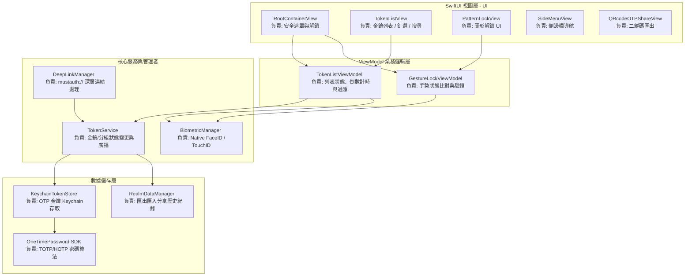
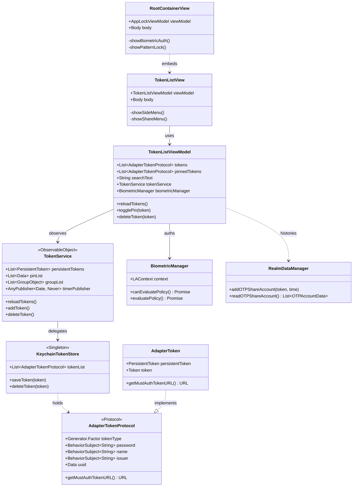
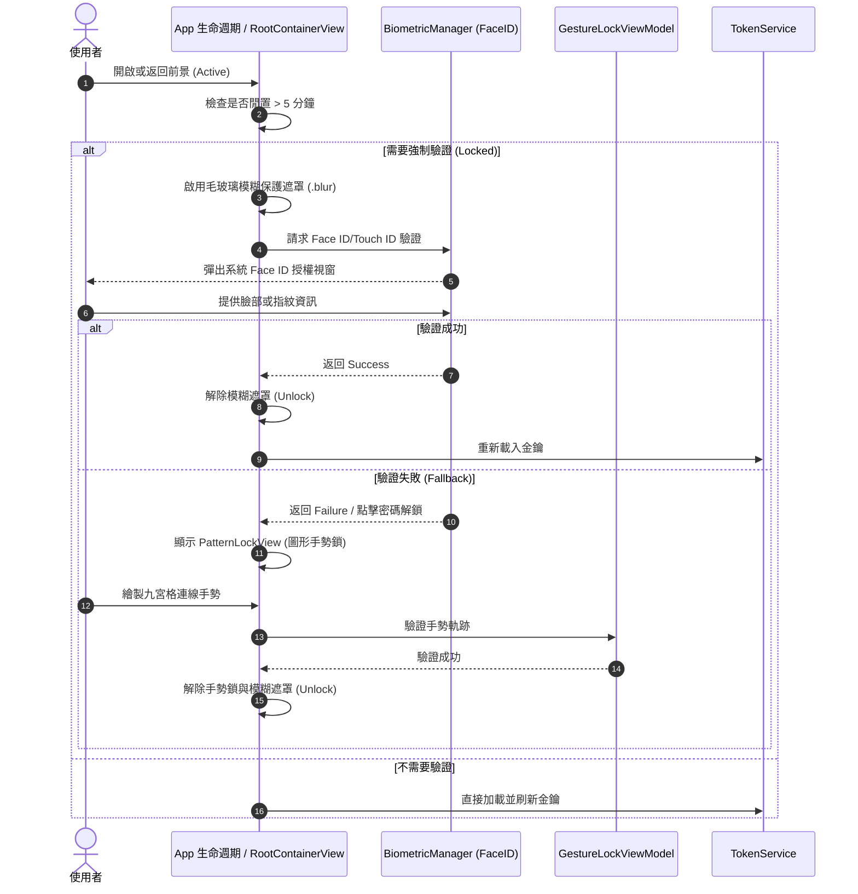
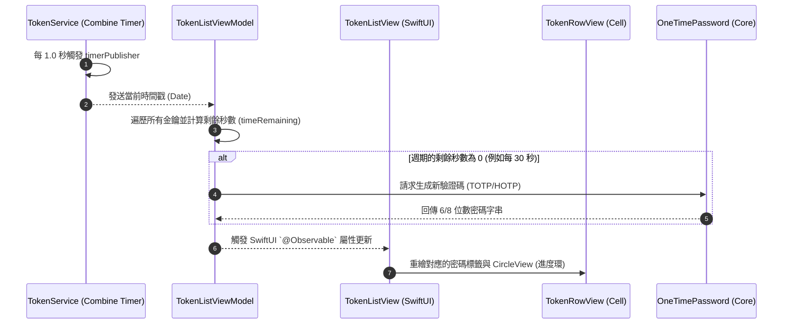

# NoSMS (MustAuth) SwiftUI 專案架構圖、類別圖與循序圖

本文件展示了 NoSMS (MustAuth) 專案在重構至 **SwiftUI + Combine (MVVM)** 架構後的系統結構與主要互動行為。

---

## 1. 系統架構圖 (System Architecture Diagram)

專案遵循標準的 **MVVM (Model-View-ViewModel)** 架構，同時將數據持久化（Keychain & Realm）與安全管控解耦。

---

## 2. 專案類別圖 (Class Diagram)

以下是主要類別、結構與協議（Protocol）的依賴與繼承關係。

---

## 3. 主要循序圖 (Sequence Diagrams)

### 3.1 App 啟動與安全驗證流

展示使用者開啟 App 時，系統如何處理前背景切換、加載模糊遮罩與執行 Face ID/圖形密碼驗證。

### 3.2 2FA 驗證碼每秒倒數與刷新流

展示全域 Combine 計時器如何每秒驅動視圖進行 2FA 代碼的刷新。

