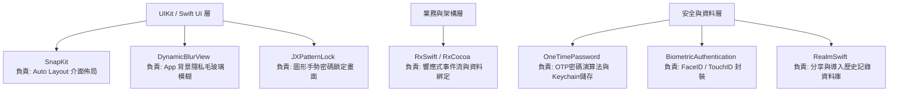

# Software Design Description (SDD) 技術規格文件

## 專案名稱：NoSMS (又稱 MustAuth)
本文件針對 NoSMS (MustAuth) iOS 專案提供系統架構、核心業務邏輯、狀態管理及第三方套件依賴分析等技術說明。

---

## 1. 功能概述與核心業務邏輯 (Functional & Core Business Logic)

NoSMS 是一款專注於安全性與使用者體驗的雙重驗證 (2FA) 金鑰生成工具，功能定位類似於 Google Authenticator，但增加了以下加強功能：

### 1.1 核心功能模組

*   **動態驗證碼生成 (OTP Generator)**
    *   支援時間型 (TOTP) 與計數器型 (HOTP) 動態金鑰。
    *   TOTP 金鑰會透過全域的 1秒計時器驅動，每隔固定週期（通常為 30 秒）自動刷新，並提供環狀進度條（CircleView）和倒數秒數提示。
    *   HOTP 金鑰則會在使用者點擊時手動計算並顯示新驗證碼。
*   **安全防護與隱私遮罩 (Security & Privacy)**
    *   **生物辨識解鎖**：支援 Face ID 或 Touch ID 解鎖，可於 App 啟動或返回前景時（在閒置超過 5 分鐘後）強制觸發驗證。
    *   **手勢密碼鎖**：當本機未啟用生物辨識時，提供替代的圖形手勢鎖（9宮格連線）。
    *   **App 隱私遮罩**：當 App 進入背景或進入多工作業切換介面時，使用毛玻璃模糊視圖覆蓋主畫面，防止敏感的 2FA 驗證碼洩露。
*   **驗證碼導入 (Import & Synchronization)**
    *   **掃描 QR Code**：透過相機即時讀取標準金鑰 URL。
    *   **相簿圖片辨識**：使用者可匯入相簿中的 QR Code 圖片，系統將從中解析出金鑰種子。
    *   **手動新增**：手動輸入發行商、帳號、金鑰密鑰（Secret Key），並自訂長度（6 或 8 位數）、演算法（SHA1/SHA256/SHA512）及刷新週期。
*   **驗證碼組織與管理 (Organization & Management)**
    *   **分組功能 (Grouping)**：支援自訂分組分頁，可將不同的金鑰帳號分配到特定群組以利分類管理。
    *   **置頂釘選 (Pinning)**：提供金鑰置頂（Pin）功能，置頂項目會獨立顯示在最上方區域。
    *   **拖曳排序 (Reordering)**：在編輯模式下，支援直接拖動儲存格進行順序微調。
*   **金鑰傳輸與分享 (URL Scheme Action & Sharing)**
    *   支援自訂 URL Scheme 協定 `mustauth://`，並根據不同的動作（Action）進行相應處理：
        *   `set`：確認並添加該金鑰。
        *   `get`：比對帳號名稱後，自動產生當前驗證碼並複製至系統剪貼簿，同時以 HUD 快顯提示。
        *   `mulitpleShare`：支援一次性批量導入多個金鑰。
    *   **分享記錄**：凡進行分享或轉移操作，均會記錄至本機資料庫。

### 1.2 核心業務邏輯流 (Key Workflows)

1.  **金鑰生命週期生命線**
    *   金鑰數據加密後存入系統 **Keychain**，確保極高的安全層級。
    *   App 啟動後，`KeychainTokenStore` 載入所有 `PersistentToken`，將其包裝為 `AdapterToken` 對象並透過 `persistentTokensBehavior` 發布。
    *   每隔 1 秒，全域計時器通知各個 `AdapterToken` 重新計算剩餘秒數，並在週期歸零時自動透過 `OneTimePassword` 原生算法計算當前 2FA 密碼，驅動 UI 更新。
2.  **App 啟動/喚醒解鎖流**
    *   `AppDelegate` 攔截 `applicationWillEnterForeground` 生命週期。
    *   如果設定開啟了 `isAuthOpen`，系統會計算自上次退到背景的時間差。若大於 300 秒（5 分鐘）或 App 屬於冷啟動，會將 `BlurViewController.shared` 以 `.overFullScreen` 模態彈出並啟動生物辨識。
    *   若生物辨識多次失敗，則 fallback 使用密碼或手勢密碼進行驗證，驗證成功後關閉模糊遮罩。

---

## 2. 畫面狀態管理 (State Management)

本專案全面使用 **RxSwift** 與 **RxCocoa** 實現響應式架構，畫面更新完全由底層「數據狀態（Data States）」驅動。

### 2.1 驅動 UI 的核心資料狀態

| 狀態名稱 / 變數 | 類型 | 職責與 UI 驅動關係 |
| :--- | :--- | :--- |
| `persistentTokensBehavior` | `BehaviorSubject<[AdapterTokenProtocol]>` | **金鑰列表狀態**。代表當前系統內所有可用的驗證碼金鑰。一旦有新增、刪除、移動或重命名，該狀態就會發送新值，觸發 `TokenListViewController` 中 `UITableView` 的 `reloadData`。 |
| `timerObserver` | `Observable<TimeInterval>` | **全域秒數時間戳**。每秒鐘發送一次最新的 UNIX 時間戳，用以計算所有 TOTP 項目當前週期的剩餘時間。 |
| `password` | `BehaviorSubject<String>` | **單一驗證碼狀態**。`AdapterToken` 計算出最新 2FA 密碼後會發送到此 Subject，直接驅動 Cell 上的 6/8 位數字 Label 更新。 |
| `lastTimeObserver` | `BehaviorSubject<String>` | **單一驗證碼剩餘秒數**。每秒更新一次，驅動 Cell 上的環狀進度條（CircleView）和倒數秒數 UI。 |
| `passwordShow` | `BehaviorSubject<Bool>` | **密碼顯示控制**。針對 HOTP 或隱私遮蔽狀態，控制驗證碼是顯示明文還是隱藏為星號或點擊後才顯示。 |
| `wantDeleted` | `BehaviorSubject<Bool>` | **刪除選取狀態**。在表格編輯模式下，控制每一列 Cell 是否被勾選欲刪除。 |
| `haveSelectTokenToDelete` | `BehaviorSubject<Bool>` | **刪除按鈕可用性狀態**。當 `wantDeleted` 陣列中存在任意一項為 `true` 時，此狀態為 `true`，從而使主畫面的底部「刪除」操作列彈出並呈現可用狀態。 |
| `groupListBehavior` | `BehaviorSubject<[GroupObject]>` | **群組列表狀態**。驅動主畫面上方的自訂分段選擇器（CustomSegmentControl）動態生成群組 Tab 標題。 |
| `indexBehaiver` | `BehaviorSubject<Int>` | **當前選取分組索引**。當使用者點擊分組 Tab 或左右滑動 `UIScrollView` 時，該狀態會被變更，進而觸發滾動容器切換至對應的 `TokenListGroupViewController` 分頁。 |
| `eventResult` | `BehaviorSubject<TokenListViewModelEvent>` | **視圖事件通知流**。包括 `.reloadData`、`.resetSearch`、`.scrollToIndex` 以及 `.addPin` / `.removePin` 等事件，負責引導視圖控制器執行特定的 UI 特效或重整。 |

---

## 3. 元件架構與第三方庫依賴分析 (Component Architecture & Dependencies)

### 3.1 系統元件架構
專案主要採行 **MVVM (Model-View-ViewModel)** 架構：
*   **Model**：`Token`、`PersistentToken`（由 OneTimePassword 定義）以及本地關聯的數據模型如 `GroupObject`、`OTPAccount` (Realm)。
*   **ViewModel**：例如 `TokenListVCViewModel` 和 `TokenScannerViewModel`，負責封裝業務邏輯與數據加工，對外暴露 Observable 狀態。
*   **View / ViewController**：基於 UIKit 的視圖元件，負責視圖宣告、佈局並與 ViewModel 進行 Rx 綁定（Data Binding）。

---

### 3.2 第三方庫依賴分析 (Third-Party Dependency Analysis)

專案在 `Podfile` 中引用了 8 個主要的第三方 Pod，其各自職責與所處系統層級分析如下：

#### 各第三方套件職責詳述：

1.  **`RxSwift` / `RxCocoa`** (`~> 5.1`)
    *   **職責**：響應式編程框架。
    *   **應用場景**：
        *   將 UI 元件（如按鈕點擊、TextField 輸入文字）轉換為事件串流。
        *   驅動定時器（Timer）與 Token 倒數邏輯的同步。
        *   實作狀態（State）的綁定，當金鑰發生異動時，主動通知 TableView 進行局部或整體的刷新。
2.  **`OneTimePassword`** (`~> 3.2`)
    *   **職責**：2FA/OTP 業務的核心加密與儲存元件。
    *   **應用場景**：
        *   **算法運算**：內建 HMAC-SHA1/SHA256/SHA512 等算法，基於時間或計數器計算當前的 OTP 密碼。
        *   **金鑰儲存**：包裝了 iOS 的 Keychain API，其 `Keychain` 與 `PersistentToken` 可將敏感的私鑰種子安全存入系統保險箱，免受越獄或沙盒破解威脅。
        *   **網址解析**：提供標準的 OTP Auth URL 解析，方便直接讀取 QR Code 字串。
3.  **`SnapKit`** (`4.2.0`)
    *   **職責**：以 Swift DSL 簡化程式碼編寫 Auto Layout。
    *   **應用場景**：
        *   專案內所有視圖控制器與自訂視圖（如 `HomePageView`、`TokenListTableViewCell`、`EditControllView`）均不使用 Storyboard/Xib，而是全部使用 SnapKit 程式碼動態設定約束條件，保證版面的彈性與螢幕適配。
4.  **`BiometricAuthentication`**
    *   **職責**：Face ID 與 Touch ID 系統授權的封裝庫。
    *   **應用場景**：
        *   免去手動呼叫 `LocalAuthentication` 繁瑣的 context 與 error 判斷。
        *   提供簡單的 `.authenticateWithBioMetrics` 與 `.authenticateWithPasscode` 接口，以便在啟動或切換到前景時快速調用系統安全認證。
5.  **`DynamicBlurView`**
    *   **職責**：即時動態毛玻璃模糊特效。
    *   **應用場景**：
        *   用於 `BlurViewController` 中。在 App 即將退到背景或生物識別驗證進行時，即時擷取當前畫面並進行高斯模糊，作為隱私遮罩層覆蓋在最上層，保護使用者 2FA 密碼不被截圖或多工作業視窗看見。
6.  **`RealmSwift`**
    *   **職責**：輕量級本機資料庫。
    *   **應用場景**：
        *   用於記錄 2FA 金鑰的匯入與分享歷史（例如 `OTPAccount` 的寫入與讀取）。因為該記錄不涉及密鑰等高度敏感隱私，所以儲存於 Realm 資料庫中，以利於進行結構化查詢與快速讀寫。
7.  **`JXPatternLock`**
    *   **職責**：手勢圖形密碼鎖定。
    *   **應用場景**：
        *   當設備不具備生物識別或使用者選擇手勢解鎖時，提供 9 宮格的圖形密碼繪製、設定與驗證介面（`GestVerificationViewController`）。
